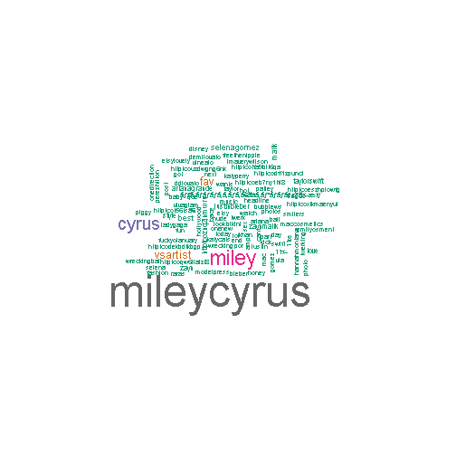

Twitter Word Cloud
========================================================
author: Frank Murphy-Hernandez
date:Sun Jan 25 15:29:42 2015


Twitter
========================================================

There is a libarary for R called TwitteR.

Twitter uses RCurl to connect R to the twitter API.

We call the 200 more recent tweets with a given hashtag.

With those tweets we make a wordcloud.

The bigger the word, the more it appears in the tweets.

Also, the colors change with the frequency.


How we do? TwitteR
========================================================


```r
library("twitteR")
load(file="twitter authentication.Rdata")
registerTwitterOAuth(cred)
```

```
[1] TRUE
```

```r
Twts<- searchTwitter(paste('#',"MileyCyrus",sep=''), n=200, cainfo="cacert.pem")
Twts_txt<- sapply(Twts, function(x) x$getText())
length(Twts)
```

```
[1] 200
```

The fist tweets
========================================================


```
[1] "RT @AndySlash93: My new guitar cover! Please favourite, comment and subscribe to my page thanks! :D #DevinTownsend #cover #MileyCyrus http:…"
[2] "Mi reina súper sexy te amo #smiler #mileycyrus http://t.co/1SaRVf6U0D"                                                                        
[3] "RT @VS_Artist: #TaylorSwift VS #MileyCyrus \n\nRT for Taylor Swift\nFAV for Miley Cyrus http://t.co/Eb7NY1TfJ8"                                
[4] "#MileyCyrus #Music Miley Cyrus Sunrise TV Appearance Live Concert Promo DVD Promotional no CD… http://t.co/4OoglfOjj6 #Hollywood #Headline"  
[5] "My new guitar cover! Please favourite, comment and subscribe to my page thanks! :D #DevinTownsend #cover #MileyCyrus http://t.co/5qgJy8OSpp"   
```

The Result
========================================================


```r
source('Nuage.R')
Cloud('MileyCyrus')
```

 

